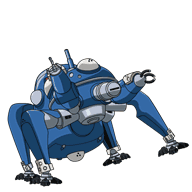

## Hi there, I'm Alex 👋

### About me

I'm a full-stack developer with expertise in JavaScript, TypeScript, Node.js, SQL and NoSQL databases, and a range of frontend technologies like Next, React, and Redux. I'm passionate about creating scalable, high-performance applications and contributing to open-source projects.

With a strong grasp of design patterns, programming paradigms, and protocols, I rely on automated testing with Jest and version control with Git and NPM to ensure the quality and reliability of my code.

If you're looking for a skilled full-stack developer or open-source collaborator, let's connect and discuss how I can help bring your project to life. Thank you for visiting my profile!

### Connect with me

### Favorite Tech

